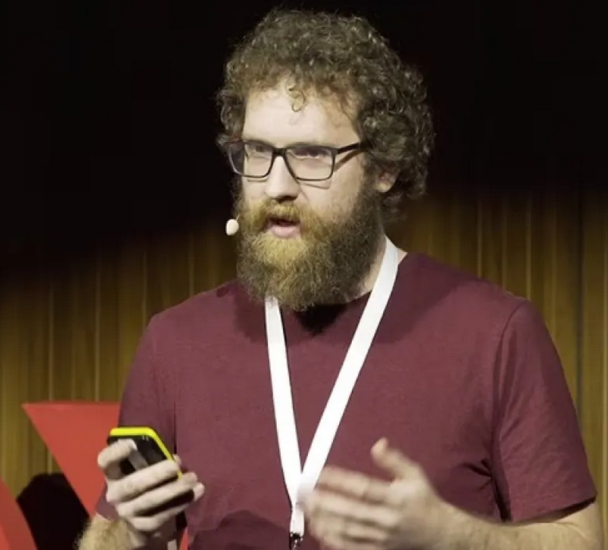
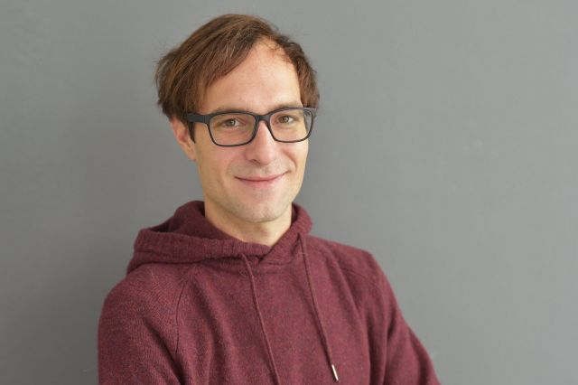
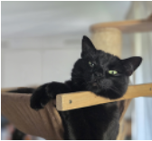

# [IEEE VIS Panel] TALK, TRY, TELL: Challenges and Opportunities for Theory-Grounded Data Visualization in Extended Reality

Andreas Bueckle1, Christiane V. R. Hütter2,3, Sebastian Pirch2, Felix Müller2,3, Philipp Friedrich2, Martin Chiettini3, Jörg Menche2,3,4,5, Katy Börner1,6

1 Department of Intelligent Systems Engineering, Luddy School of Informatics, Computing, and Engineering, Indiana University, Bloomington, IN, USA\
2 Ludwig Boltzmann Institute for Network Medicine, University of Vienna, Vienna, Austria\
3 Department of Structural and Computational Biology, Max Perutz Labs, University of Vienna, Vienna, Austria\
4 CeMM Research Center for Molecular Medicine of the Austrian Academy of Sciences, Vienna, Austria\
5 Faculty of Mathematics, University of Vienna, Vienna, Austria\
6 CIFAR MacMillan Multiscale Human, Canadian Institute for Advanced Research (CIFAR), Toronto, ON, Canada

# Time and Date
Wednesday, November 5, 2025 11:15am - 12:30pm (CET) in room 0.11+0.12 during [IEEE VIS](https://ieeevis.org/year/2025/info/program/panels#talk-try-tell-challenges-and-opportunities-for-theory-grounded-data-visualization-in-extended-reality)

# Motivation 
2D visualization frameworks are screen bound and do not provide extensive human-data interaction modes, which XR can offer. 3D systems and environments open up the possibilities of intuitive interaction with three-dimensional data representations - to interpret and use those as effectively as established, mature 2D visualization tools, new supporting frameworks are needed.

# Trailer
<iframe width="560" height="315" src="https://www.youtube.com/embed/fNdn4Pk3MwE?si=0_8nw_b4DivWlqxZ" title="YouTube video player" frameborder="0" allow="accelerometer; autoplay; clipboard-write; encrypted-media; gyroscope; picture-in-picture; web-share" referrerpolicy="strict-origin-when-cross-origin" allowfullscreen></iframe>

# Abstract 
Numerous formalizations have emerged for creating, interpreting, and teaching data visualizations. The past decade has witnessed significant advances in visualization paradigms beyond keyboard and mouse, like immersive analytics. Mature visualization ecosystems are established for screen-based technologies; however, no counterparts have emerged yet in the immersive visualization domain. Consistent implementations are limited due to scattered tools and platforms, while theoretical frameworks require extension to extended reality (XR).

**“TALK, TRY, TELL: Challenges and Opportunities for Theory-Grounded Data Visualization in Extended Reality”** addresses these gaps through an innovative "TALK, TRY, TELL" format that combines theoretical discourse with hands-on experience. Expert speakers present their own research on theory and practice and examine how established principles translate to immersive environments, representing a diverse and balanced spectrum from XR specialists and information designers, including implementers and theorists (**TALK**). 

Following the presentations, attendees will engage with three virtual reality (VR) demonstration applications built on different engines and hardware to exemplify approaches in immersive analytics: biomedical data visualization involving 3D models of adult human anatomy, collaborative network visualization and analysis, as well as immersive and ubiquitous analysis via XR on the web (**TRY**). 

During the TRY phase, the audience will be invited to share their insights on the individual experiences exhibited via a digital whiteboard (**TELL**). This format ensures attendees not only understand the conceptual challenges but also experience the perceptual and interaction complexities first-hand. The panel aims to establish a roadmap for developing both theoretical foundations and practical toolkits to advance data visualization in XR as a mature field with strong theory and practice within the visualization community.

**Figure 1**. Talk, Try, Tell: We are proposing an innovative panel format to discuss theory-grounded data visualization in XR. Exemplarily shown is [DataDiVR](https://github.com/menchelab/DataDiVR_WebApp). 

# Description of the Panel Topic

Numerous formalizations have emerged for creating, interpreting, and teaching data visualizations. The past decade has seen significant advances in visualization paradigms beyond keyboard and mouse, such as immersive analytics, yet existing theoretical frameworks and practical tools remain inadequate for capturing the unique affordances of extended reality (XR) environments, such as virtual reality (VR), augmented reality (AR), and mixed reality (MR). While 2D (and, to some extent, 3D) visualizations benefit from mature ecosystems (seaborn, d3.js/Vega-Lite, ggplot2) and a cornucopia of no-code tools (Power BI, Tableau, Flourish), the XR landscape lacks equivalent standardized approaches. Current immersive visualization development is fragmented across platforms—Unity, Unreal Engine, WebXR—each requiring specialized expertise and offering limited theoretical grounding for design decisions and libraries to consistently implement them. This panel addresses these gaps through an innovative "TALK, TRY, TELL" format that combines theoretical discourse with hands-on experience. Five expert speakers will present their own research on XR visualization theory and practice and examine how established principles translate to immersive environments and where new frameworks are needed. Our panelists represent a diverse and balanced spectrum of expertise, including both XR specialists and information designers as well as implementers and theorists (**TALK**).

Following the presentations, the audience will engage with three VR applications that exemplify different approaches to immersive visual analytics: biomedical data visualization involving 3D models of human adult anatomy in the Human Reference Atlas (HRA) Organ Gallery in VR, implemented with Unity, running on the stand-alone, consumer-grade Meta Quest 3 (see [Meta Horizon Store](https://www.meta.com/experiences/5696814507101529]), collaborative network analysis in DataDiVR made with Unreal Engine and running on a VR-ready PC (**TRY**, see [GitHub](https://github.com/menchelab/DataDiVR_WebApp) and Figure 1), and DashSpace, built natively for the web (see [paper](https://ieeexplore.ieee.org/document/10869395/)).

The hands-on experience will inform a final discussion synthesizing theoretical insights with practical observations from the demos. Concretely, during the TRY phase, the audience will be invited to share their insights on the individual experiences exhibited via a digital whiteboard (**TELL**). This format ensures attendees not only understand the conceptual challenges but also experience the perceptual and interaction complexities firsthand. The panel aims to establish a roadmap for developing both theoretical foundations and practical toolkits that can advance data visualization in XR as a mature field with strong theory and practice within the visualization community.

# Short Description of the Panel Format and Anticipated Schedule

We will maximize the usefulness of this panel for all attendees, regardless of domain expertise and prior exposure to XR. To that end, panelists will give six-minute lightning talks, followed by a 20-minute moderated panel discussion and Q&A with audience involvement (TALK). Then, using the local presence of the organizers from the University of Vienna team, including Hütter and Menche, a 20-minute demo session will be held where attendees can try out some of the applications discussed in the panel (TRY). While this is active, there will be stations where we will solicit feedback and questions from the audience via a digital whiteboard. Finally, a 15-minute debriefing session will round up the 90-minute panel (TELL).

| **Starts at [CET]** | **Duration [mins]** | **Activity**     | **Description**                                                                                                                                                                                                                     |
| ------------------- | ------------------- | ---------------- | ----------------------------------------------------------------------------------------------------------------------------------------------------------------------------------------------------------------------------------- |
| 11:15 AM            | 5                   | Introduction     | Organizers Bueckle and Hütter provide a brief intro to the goals of the panel                                                                                                                           |
| 11:20 AM            | 30                  | TALK             | Lightning talks (5 mins per speaker and 1 min for transitions) with shared slide deck                                                                                                                                                                         |
| 11:50 AM            | 20                  | Panel discussion | Following the lightning talks, attendees (and panelists) will be able to ask (and answer) questions                                                                                                                                 |
| 12:10 PM            | 20                  | TRY              | The audience explores three different VR experiences and then gives feedback via a digital whiteboard. Enough VR equipment will be available accommodate large crowds, and VR headsets will stream to large screens with narration. |
| 12:30 PM            | 15                  | TELL             | Debriefing: The most relevant audience comments, questions, and ideas from the board will be discussed.                                                                                                                             |
| 12:45 PM            | 1                   | Group photo      | Panelists and organizers take a photo on stage.                                                                                                                                                                                     |

# TALK: Speakers/Panelists

**Niklas Elmqvist, Ph.D.**, Villum Investigator and Professor, Department of Computer Science, Aarhus University, Aarhus, Denmark, and Director of the Center for Anytime Anywhere Analytics (CA3).
**Web**: [https://cs.au.dk/~elm/](https://cs.au.dk/~elm/)
**Contribution/Expertise**: Data visualization and human-computer interaction (HCI); coined the term "ubiquitous analytics"; working with immersive analytics; to offer insights and expertise into advanced and novel approaches of human-artificial intelligence (AI)/machine learning (ML) teamed interaction; to provide a foundation for integrating theory and practice—towards ubiquitous analytics from visual frameworks and design theory to immersive applications.

**Dr. Renata G. Raidou**, Associate Professor in Biomedical Visualization and Visual Analytics, Institute of Visual Computing and Human-Centered Technology, Vienna University of Technology, Austria.
**Web**: [http://www.renataraidou.com](http://www.renataraidou.com)
**Contribution/Expertise**: Visual analytics researcher with focus on data visualization within and beyond screens, including physical data representation approaches; application-driven research on data exploration and visual analytics; to extend discussion towards immersive digital and physical representation of complex data for diverse audiences.

**Chris Bryan, Ph.D.**, Assistant Professor, School of Computing and Augmented Intelligence, Arizona State University, Tempe, AZ, USA.
**Web**: [https://chrisbryan.github.io](https://chrisbryan.github.io)
**Contribution/Expertise**: Data visualization and visual analytics with a focus on human-centered design and explainability; emphasis on making complex data interpretable through interactive and accessible visual systems; to provide perspectives on explainable immersive visual analytics, bridging technical visualization systems with interpretability and usability for diverse audiences.

**Dr. Hannes Kaufmann**, Full Professor, Vienna University of Technology, Austria.
**Web**: [https://www.vr.tuwien.ac.at/people/hannes-kaufmann](https://www.vr.tuwien.ac.at/people/hannes-kaufmann)
**Contribution/Expertise**: Virtual and augmented reality; design and realization of mixed reality lab including studios for immersive video recording, streaming and remote collaborations; to share user (developer) perspectives of software/hardware state-of-art.

**Peter Mindek, Ph.D.**, Co-founder and Chief Technical Officer, Nanographics.
**Web**: [https://nanographics.at](https://nanographics.at )
**Contribution/Expertise**: Scientific visualization, storytelling, visual abstraction, software architecture; to share a developer's perspective on software requirements for creating high-quality visuals in real-time for interactive applications.

# TRY: Applications 

- HRA Organ Gallery VR: [https://humanatlas.io/hra-organ-gallery](https://humanatlas.io/hra-organ-gallery)
- DataDiVR: [https://github.com/menchelab/DataDiVR_WebApp](https://github.com/menchelab/DataDiVR_WebApp)
- DashSpace: [https://ieeexplore.ieee.org/document/10869395/](https://ieeexplore.ieee.org/document/10869395/)

# TELL: User Studies and Experiences 

There will be a Figma board to collect input from users during the TRY phase. 

# Organizers

**Andreas Bueckle, Ph.D.** ([https://andreas-bueckle.com](https://andreas-bueckle.com)), is the Research Lead in the Cyberinfrastructure for Network Science Center (CNS) at Indiana University. His research interest is information visualization in XR. He has a TEDx talk titled “Living and Learning in the Metaverse” (see [this YouTube video](https://www.youtube.com/watch?v=BpnLKoAK1YE)). He was awarded a R03 award (see [NIH Reporter](https://reporter.nih.gov/search/oQWN8hJ2EkWfCtqXHyTq0A/project-details/11123677)) as well as two JumpStart Fellowships ([https://hubmapconsortium.org/jumpstart-program/#andreas2024](https://hubmapconsortium.org/jumpstart-program/#andreas2024)) by the National Institutes of Health to advance multiscale exploration of the human body in VR with the HRA Organ Gallery ([https://humanatlas.io/hra-organ-gallery](https://humanatlas.io/hra-organ-gallery)).

**Christiane V. R. Hütter** is an architect and computational bioengineer as well as Ph.D. Candidate at the Ludwig Boltzmann Institute for Network Medicine, working on visual data exploration in immersive systems. Her work extends beyond disciplines, curating ([https://www.whatevr.xyz](https://www.whatevr.xyz)) and participating in various media art exhibitions ([https://ars.electronica.art/center/en/events/deep-space-experience-premiere-connected-how-the-world-is-morethan-the-sum-of-its-parts](https://ars.electronica.art/center/en/events/deep-space-experience-premiere-connected-how-the-world-is-morethan-the-sum-of-its-parts/)).

**Sebastian Pirch** is a 3D digital artist, designer, lead developer, systems architect, and VR engineer at the Ludwig Boltzmann Institute for Network Medicine at the University of Vienna. His work is frequently exhibited at conferences, art venues, and international events, where he explores how digital tools, AI, and VR can enhance science communication and public engagement.

**Felix Müller** is a senior data scientist at the Ludwig Boltzmann Institute for Network Medicine, focusing on biological networks. He applies modern computational techniques to analyze biomedical data, integrating concepts from network theory, statistical physics, and machine learning to extract meaningful insights from large-scale biological interaction networks.

**Philipp Friedrich** is a software architect at the Ludwig Boltzmann Institute of Network Medicine at the University of Vienna, designing applications and systems tailored to the interactive analysis of large-scale complex and diverse data modalities.

**Martin Chiettini** is a digital artist, technologist, and IT infrastructure lead at the Ludwig Boltzmann Institute for Network Medicine at the University of Vienna and the Max Perutz Labs at the Vienna BioCenter. His artistic work explores the intersection of the physical and digital, often engaging with themes of spatial perception, performance art, and artificial intelligence.

**Jörg Menche, Ph.D.**, is a professor at the University of Vienna, holding a dual appointment at the Max Perutz Labs and the Faculty of Mathematics, and is the director of the Ludwig Boltzmann Institute for Network Medicine. A physicist by training, his interdisciplinary team—spanning biology, bioinformatics, medicine, and the arts—leverages network theory to investigate molecular interactions underlying health and disease through cutting-edge technologies, from AI to VR.

**Katy Börner, Ph.D.**, is the Victor H. Yngve Distinguished Professor of Engineering and Information Science in the Department of Intelligent Systems Engineering, Core Faculty of Cognitive Science, and Founding Director of CNS at Indiana University. She is a curator of the international Places and Spaces exhibit ([https://scimaps.org](https://scimaps.org/)). She was elected as an American Association for the Advancement of Science (AAAS) Fellow in 2012, obtained an Alexander von Humboldt Fellowship in 2017, and a Stiftung Charité Visiting Fellowship in 2025. 

# Acknowledgments

This panel was made possible through support from the the [CIFAR MacMillan Multiscale Human program](https://cifar.ca/research-programs/cifar-macmillan-multiscale-human/).

# About

This companion website for the panel is maintained by the organizers. Andreas Bueckle, Christiane V.R. Hütter, and Martin Chettini contributed text and images.
